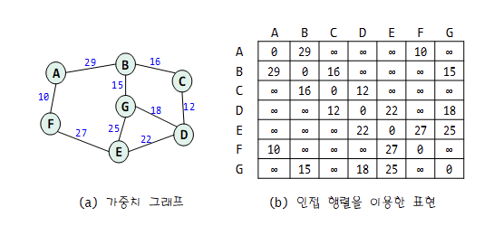

# 가중치 그래프

#### 1. 가중치 그래프란

- 간선에 비용이나 가중치가 할당된 그래프를 가중치 그래프(weighted graph)라고 한다. 정점의 연결 정보뿐만 아니라 연결에 필요한 비용을 함께 표현할 수 있다.
- 아래와 그래프가 있다면, 이 그래프에서 `정점은 주요도시`를 나타내고 `간선은 두 도시를 직접 연결하는 고속도로`이며, `간선의 가중치는 연결된 두 도시의 거리나 이동 비용` 등을 나타낼 수 있다.


- 가중치 그래프는 수학적으로는 `G=(V, E, w)`와 같이 표현한다. `V(G)는 그래프 G의 정점들의 집합`을, `E(G)는 그래프 G의 간선들의 집합`을 의미하고, `w(e)는 간선 e의 강도, 비용, 또는 길이`라고 부른다. 어떤 가중치 그래프의 경로를 `p = (v0, v1, v2, … vk)`라고 한다면 경로의 강도 w(p)는 [&space;=&space;\sum_{i=i}^{k}w(v_{i-1},&space;v_{i}))] 를 통해 `경로 상의 모든 간선의 강도 합`으로 표현된다.

#### 2. 가중치 그래프의 표현

- 가중치 배열을 만드는 방법도 있지만 기존 배열에서 가중치를 바로 저장하는 방식이 메모리를 덜 소비한다.
- 간선이 있는 경우에는 양수의 값을 넣어주고, 간선이 없는 경우에는 매우 큰 값(INF)를 넣어줘 간선의 유무를 판단한다.



#### 3. 가중치 그래프를 이용한 최소 비용 신장트리(MST(Mininum Spanning Tree))

- MST 조건

  - (1) 반드시 n - 1개의 간선으로 n개의 노드(정점)를 연결해야한다.
  - (2) 사이클이 포함되서는 안된다.
  - (3) 간선의 가중치의 합이 최소여야한다.

- MST 관련 알고리즘

  - Kruskal Algorithm 이 알고리즘은 `그 순간에 최적`이라는 모토를 가지고 정점을 방문한 순간 간선 중 가장 낮은 가중치의 간선 선택의 누적으로 `최소비용 신장트리(MST)`가 만들어지는 것이다. 즉, 각 단계에서 사이클을 이루지 않는 최소 비용 간선을 선택해야한다.

    - (1) 그래프의 모든 간선을 `가중치에 따라 오름차순으로 정렬`한다.

    - (2) 가장 `가중치가 작은 간선 e`를 뽑는다

    - (3) e를 넣어 신장트리에 `사이클이 생기면 넣지 않고 2번으로 이동`한다.

    - (4) 사이클이 생기지 않으면 최소 신장 트리에 삽입한다.

    - (5) n - 1개의 간선이 삽입될 때까지 2번으로 이동한다.

      

      ​

  - Kruskal Algorithm을 통한 MST를 사용할 때 사이클이 생기는 경우를 찾는 방법은 `지금 추가하고자 하는 간선의 양끝 정점이 같은 집합에 속해있는지를 판단` 하는 `Union-Find`를 알아야한다.

    

    - 사진(왼쪽)같은 집합이면 사이클이 생기므로 추가하면 안되고, 사진(오른쪽)같이 찾은 정점이 다른 집합에 들어있으면 추가한다.
    - `Union-Find` 에서 `Find는 원소가 속하는 집합이 무엇인지를 알아내는 것이고` `Union은 집합을 입력받아서 합집합을 만드는 연산`이라고 한다.
    - (유니온파인드 자료구조 URL 삽입 예정)

  - Kruskal Algorithm의 시간 복잡도

    - `Union-Find` 알고리즘을 이용하면 Kruskal Algorithm의 시간 복잡도는 간선들을 정렬하는 시간에 좌우된다.

      즉, 간선 e개를 `퀵 정렬` 과 같은 효율적인 알고리즘으로 정렬한다면 Kruskal Algorithm의 시간 복잡도는  ` O(elog₂e)` 이 된다.(대략 간선이 200000개이면 1초 이내이다.)

  - Kruskal Algorithm 구현

    ```c++
    /* 1<= 정점(V) <= 10,000, 1<= 간선(E) <= 100,000, |가중치(W)| <= 1,000,000 일 때 정점, 간선의 갯수 및 각각의 간선의 정보를 입력받아 MST를 구현해라 */

    #include <cstdio>
    #include <vector> 	 // 백터를 사용하기 위해 필요. 
    #include <algorithm> // 백터 정렬을 위해 필요.

    using namespace std;

    int V, E; // 정점 V, 간선 E
    int parent[10001]; // Union-Find를 사용하기 위해
    int result;

    // Vector에 들어갈 간선이 연결된 각각의 정점(A, B)와 가중치(W)
    typedef struct _pos { 
      int A, B, W;
    }pos;

    //(1) 그래프의 모든 간선을 가중치(W)에 따라 오름차순으로 정렬하기 위해
    bool cmp(const pos& p, const pos& q) { 
      return p.W < q.W;
    }

    vector<pos> Vec; // 간선의 정보를 넣기위한 Vector 선언

    // x가 속한 집합의 대표값(루트 노드 값)을 반환한다. 즉, x가 어떤 집합에 속해 있는지 찾는 연산함수..
    int find_(int x) { 
    	if (parent[x] == x) return x;
    	return parent[x] = find_(parent[x]);
    }

    int main() {
    	scanf("%d %d", &V, &E);

      // Union-Find의 make-set단계로 i와 같이 각자 다른 집합 번호로 초기화한다.
    	for (int i = 1; i <= V; i++) {
    		parent[i] = i;
    	}
    // 간선의 정보를 Vector에 넣어준다. 
    	for (int a, b, c, i = 0; i < E; i++) {
    		scanf("%d %d %d", &a, &b, &c);
    		Vec.push_back(pos({ a, b, c }));
    	}
      
    	sort(Vec.begin(), Vec.end(), cmp); // 가중치에 따른 오름차순으로 정렬
      
    	int sz = Vec.size();
      	int cnt = 0; // 모든 정점이 연결되었는지 판단하기 위해..
      // (2) s가 0 ~ Vec.size()까지 증가하며 가장 가중치가 작은 간선 e를 뽑는다
    	for (int s = 0; s < sz; s++) {
    		int a_head = find_(Vec[s].A);
    		int b_head = find_(Vec[s].B);
          //(3) e를 넣어 Union-Find를 통해 a_head와 b_head를 찾고 만약 둘이 같으면 신장트리에 사이클이 생기는 것이므로 넣지 않고 2번으로 이동한다.
          
          //(4) 만약 a_head와 b_head가 다르다면 사이클이 생기지 않은 경우이므로 최소 신장 트리에 삽입한다.
    		if (a_head != b_head) {
    			parent[a_head] = b_head;
    			result += Vec[s].W;
              	 cnt++;
              	 if(cnt == V - 1) break; //(5) V - 1개의 간선이 삽입될 때까지 2번으로 이동한다. 만약 V - 1개의 정점이 뽑혔다면 모든 정점이 연결되었으므로 break를 통해 나온다. 
    		}
    	}
    	printf("%d\n", result);
    	return 0;
    }
    ```


    ​```

    